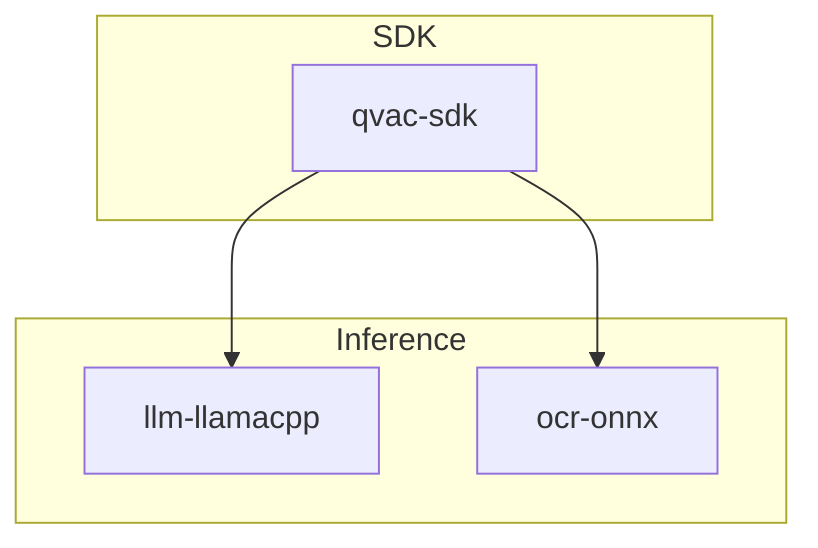
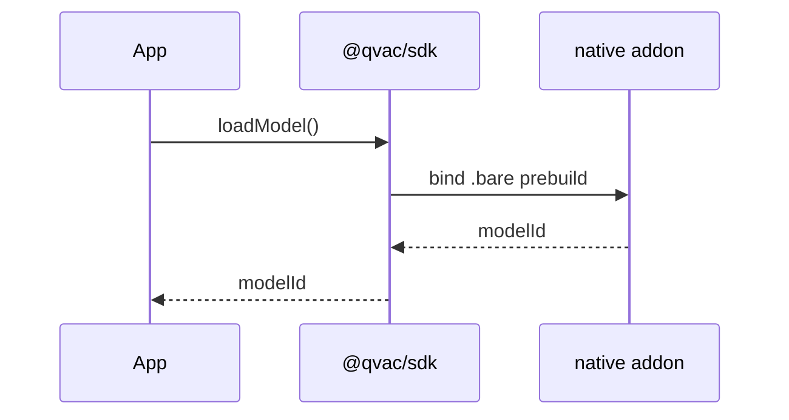
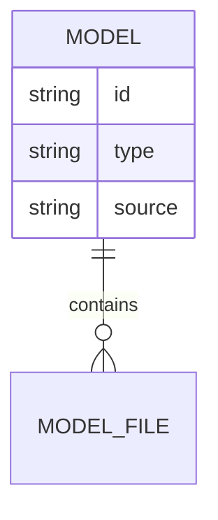
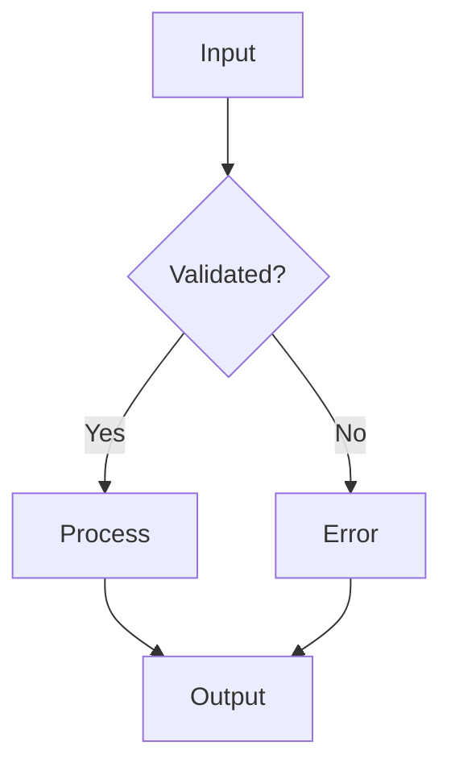

# Skill: diagrams

**Trigger:** invoked by `/init` or `/diagrams`. Generates and maintains all Mermaid diagrams and flow documentation.

## Workspace context

This is the qvac-workstation: a multi-repo workspace with `qvac/` (JS/TS/C++ monorepo) and `qvac-rnd-fabric-llm-bitnet/` (research artifacts + Python eval scripts). Diagrams must reflect both subrepos when relevant.

## Universal diagram rules
- ALWAYS use Mermaid inside markdown fences: ` ```mermaid ... ``` `.
- ALWAYS add a `Last Updated: YYYY-MM-DD` line at the top of each file.
- ALWAYS write a 1–3 sentence plain-English explanation above each diagram.
- UPDATE diagrams whenever new modules, routes, models, or services appear.
- NEVER delete a diagram. If a component is removed, mark its node as `[REMOVED]` and keep it in the graph.
- Use consistent styling across files.

---

## Diagrams in `docs/diagrams/`

### 1. `architecture.md`
Mermaid `graph TD` (or C4) showing:
- Top-level components in `qvac/packages/*` (sdk, cli, llm-llamacpp, ocr-onnx, tts-onnx, embed-llamacpp, transcription-*, rag, registry-server, dl-* loaders, error, logging, infer-base).
- Research artifacts subrepo as a separate subgraph.
- External integrations inferred from `package.json` (e.g. `@huggingface/*`, `bare-*`, `vcpkg`, `onnxruntime`, `llama.cpp`).
- Connections inferred from imports and config.

### 2. `dependencies.md`
Mermaid graph grouping detected packages by category:
- **Web/HTTP**: express, fastify, cors, helmet, openai-compatible HTTP layer
- **Native runtime**: bare, bare-make, vcpkg
- **Inference**: llama.cpp, onnxruntime, whisper.cpp, parakeet, nmt.cpp, diffusion.cpp
- **Data**: dl-filesystem, dl-hyperdrive, hyperdrive
- **Validation**: zod
- **Logging/Errors**: logging, error-base
- **Testing**: brittle, standard, googletest
- **Python eval**: huggingface_hub, transformers, datasets (if listed in research repo)
Show which `qvac/packages/*` consume which deps.

### 3. `data-model.md`
If ORM/schema detected (Zod groupings, Prisma/Drizzle/TypeORM, SQLAlchemy):
- Generate Mermaid `erDiagram` of entities and relationships.
- Infer relationships from `relationship()`, foreign keys, or Zod `.merge()`/refs.
If none found (typical here — no central ORM), write a placeholder explaining that QVAC is a local-first inference SDK with model registry metadata rather than a relational schema, plus instructions for adding a model when one is introduced.

### 4. `deployment.md`
If `Dockerfile`, `docker-compose.yml`, or `k8s/` exists:
- Generate Mermaid graph of services, ports, volumes, networks.
- Include CI/CD entry points from `.github/workflows/`.
If none at workstation root, scaffold a placeholder noting that `qvac/` ships native prebuilds rather than containers, and the research repo distributes binaries via GitHub Releases of the external `qvac-fabric-llm.cpp` repo.

---

## Flows in `docs/flows/`

### 1. `request-flow.md`
Mermaid `sequenceDiagram` for a typical SDK call:
- Client → `@qvac/sdk` API (e.g. `loadModel`, `completion`)
- → `infer-*` package selection (e.g. `llm-llamacpp`)
- → native addon (Bare runtime, prebuilt `.bare`)
- → response/streaming back to caller
Label each step with the actual package names detected in `qvac/packages/`.

### 2. `auth-flow.md`
If auth libs detected (jsonwebtoken, passport, jose, authlib, django auth, HF token verification):
- Generate Mermaid `sequenceDiagram` covering token acquisition and protected resource access.
If none, write a placeholder noting that QVAC is local-first with no central auth, but `HF_TOKEN`/`GH_TOKEN`/`NPM_TOKEN` are required at build time (per `qvac/.env.example`).

### 3. `data-flow.md`
Mermaid `flowchart TD` showing:
- Inputs: SDK calls, CLI commands, HTTP server (OpenAI-compatible), P2P peers.
- Validation: Zod schemas where present.
- Processing: model loading via data loaders (`dl-filesystem`, `dl-hyperdrive`).
- Persistence: model files cached locally, registry metadata.
- Outputs: streaming tokens / inference results / file artifacts.

### 4. `error-flow.md`
Mermaid `flowchart TD` showing:
- Source (native addon failure, validation error, network)
- Wrapping in `error` / `QvacErrorBase` (per `qvac/CLAUDE.md` conventions, errors preserve `cause`)
- Logging via `qvac/packages/logging`
- Surface to caller (rejected promise, stream error event, CLI exit code)

---

## Index files

### `docs/diagrams/index.md`
```markdown
# Architecture Diagrams

| File | Description | Last Updated |
|------|-------------|--------------|
| architecture.md | System component overview | YYYY-MM-DD |
| dependencies.md | Package dependency graph | YYYY-MM-DD |
| data-model.md | Entity relationship diagram | YYYY-MM-DD |
| deployment.md | Deployment and infrastructure | YYYY-MM-DD |
```

### `docs/flows/index.md`
```markdown
# Flow Diagrams

| File | Description | Last Updated |
|------|-------------|--------------|
| request-flow.md | API request lifecycle | YYYY-MM-DD |
| auth-flow.md | Authentication flow | YYYY-MM-DD |
| data-flow.md | Data processing pipeline | YYYY-MM-DD |
| error-flow.md | Error propagation handling | YYYY-MM-DD |
```

---

## Mermaid style guide

### Graph


### Sequence


### ER


### Flowchart

