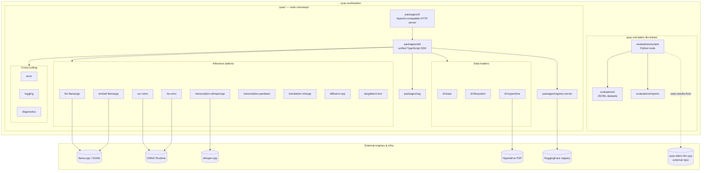

# Architecture Overview

Last Updated: 2026-05-09

This diagram shows the top-level components of the `qvac-workstation`. The two subrepos are independent: `qvac/` is the active monorepo (TypeScript SDK over native C++ inference addons), and `qvac-rnd-fabric-llm-bitnet/` is a research-artifacts repo whose source code lives in an external project. External integrations (model registry, P2P transport via Hyperdrive, ONNX/llama.cpp engines) are shown as separate nodes.

