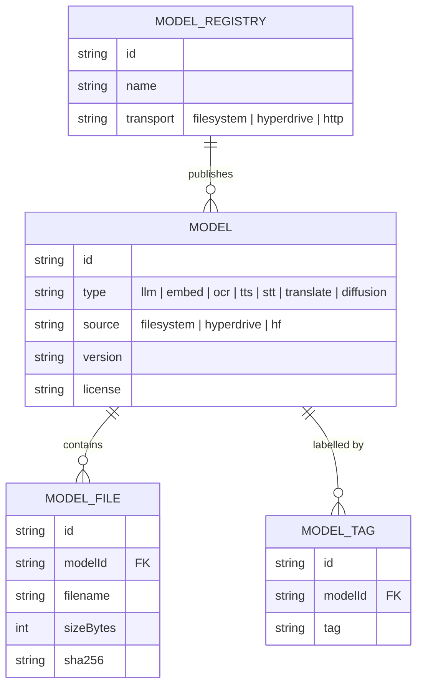

# Data Model

Last Updated: 2026-05-09

QVAC is a local-first inference SDK; it does **not** maintain a relational database or central ORM at the workstation level. There are no SQLAlchemy, Prisma, Drizzle, or TypeORM schemas detected. The closest equivalent is the **model registry** (handled by `packages/registry-server` and consumed by the SDK and data loaders), which describes downloadable model artifacts and their metadata. The placeholder below sketches that conceptual shape so future ADRs / diagrams have a starting point. Replace with a real `erDiagram` once a persisted schema is introduced.

## Notes

- The diagram is illustrative. No code at the workstation level enforces this schema today.
- If/when persistent storage lands (e.g. SQLite cache for the registry, Drizzle/Prisma migrations, etc.), update this file to reflect the real model and create an ADR for the choice.
- The research repo's JSONL datasets (`biomedqa_data/`, `email_style_transfer/`) are flat files, not relational.
