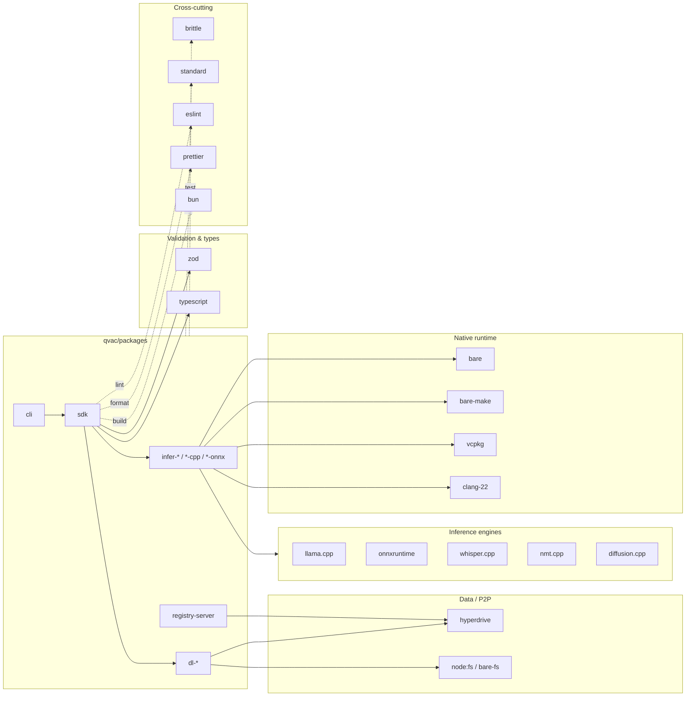

# Package Dependencies

Last Updated: 2026-05-09

This diagram groups the major external dependencies used across `qvac/packages/*` by category, and shows which package category consumes which group. The `qvac-rnd-fabric-llm-bitnet/` repo has no `requirements.txt` at present — its scripts import standard libraries plus `huggingface_hub` ad-hoc. The `/init` skill will refresh this when a real dependency manifest appears or when `package.json` files change.

