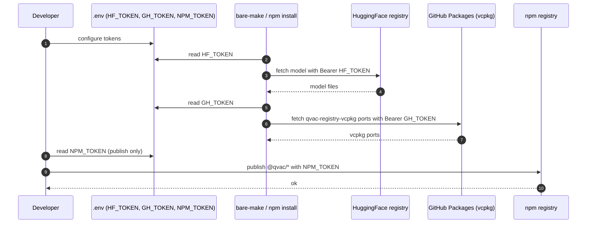

# Auth Flow

Last Updated: 2026-05-09

QVAC is **local-first** and does not ship application-level user auth (no jsonwebtoken, passport, jose, authlib, or django auth detected at the workstation level). The auth surface that does exist is **build-time / registry-access tokens** (`HF_TOKEN`, `GH_TOKEN`, `NPM_TOKEN` per `qvac/.env.example`), used to fetch models from HuggingFace, vcpkg packages from GitHub Packages, and to publish to npm. The diagram captures that flow as a placeholder. Replace with a real per-request auth sequence if/when the SDK or CLI gains an authenticated mode.

## Notes

- No request-time authentication exists in `packages/sdk` or `packages/cli` today.
- If a hosted variant of the OpenAI-compatible server is introduced, this flow must be replaced with a real login → token issuance → protected-route sequence and an ADR raised.
