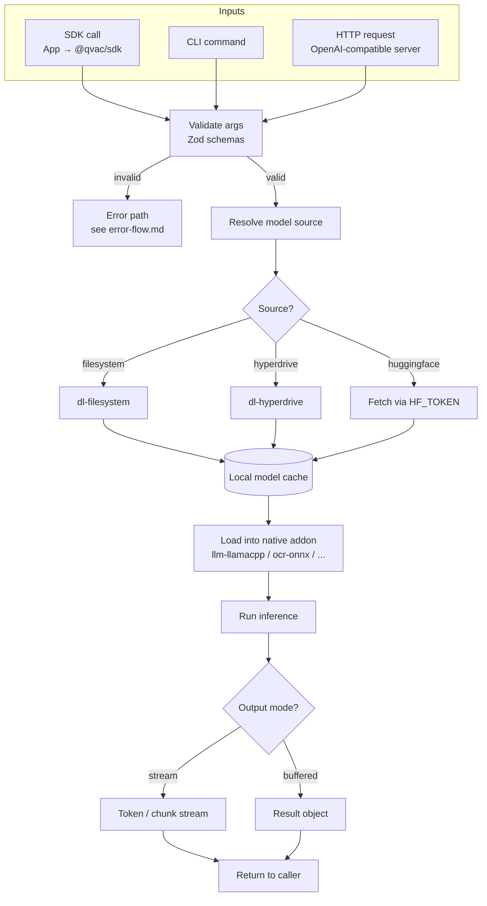

# Data Flow

Last Updated: 2026-05-09

This flowchart shows how data enters QVAC, gets validated and processed, and is returned to the caller. Inputs come from three surfaces: direct SDK calls, CLI invocation, and the OpenAI-compatible HTTP server (also in `packages/cli`). Validation is performed primarily by Zod schemas co-located with the code paths. Model artifacts are fetched by `dl-*` loaders (filesystem cache or P2P via Hyperdrive). Inference happens in native addons, and results stream back as token chunks or buffered artifacts.

