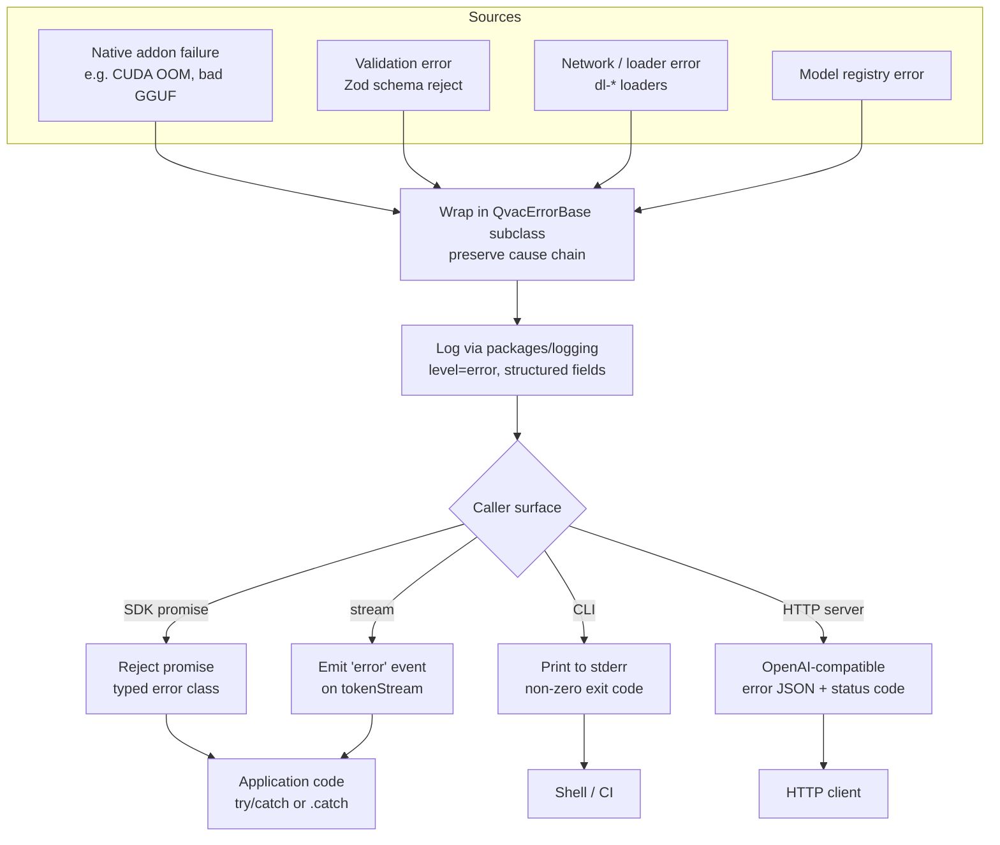

# Error Flow

Last Updated: 2026-05-09

The flow shows how errors propagate from their origin (native addon, validation layer, network) up through the QVAC error wrappers (`packages/error` / `QvacErrorBase`) and out to the caller. Per the conventions in `qvac/CLAUDE.md`, all errors must use structured error classes and preserve the original `cause`. Logging is centralized in `packages/logging`.

## Notes

- Strict rule from `qvac/CLAUDE.md`: never swallow errors, always preserve `cause`.
- Test failures from `brittle` integration tests must never be skipped or weakened — fix the code or the test.
- Native-addon failures sometimes manifest as process crashes when not properly bridged; check that prebuilds match the host triplet.
