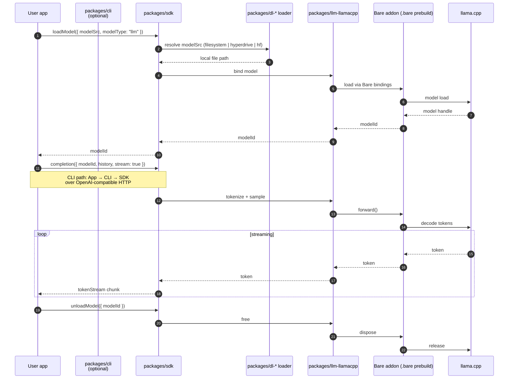

# Request Flow

Last Updated: 2026-05-09

The diagram traces a typical SDK call (`completion`) from an end-user app through the QVAC SDK, into the appropriate inference package, down to the native addon (a Bare runtime `.bare` prebuild built from the C++ engine, e.g. llama.cpp), and back as a streamed token sequence. The CLI path is identical except a request first hits the OpenAI-compatible HTTP server in `packages/cli`.

